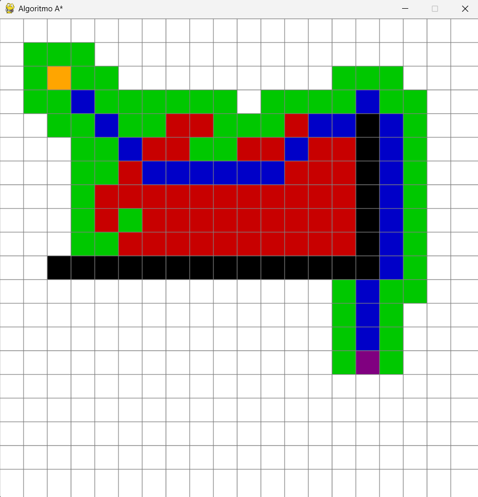

# Algoritmo A*

## Características

- Movimientos rectos y diagonales con pesos configurables en codigo
- Heurística de distancia Manhattan multiplicada por un factor (`HEURISTICA_PESO`) para reducir la exploración innecesaria

## Colores Utilizados

| Color | Significado |
|-------|-------------|
| 🟧 Naranja | Nodo de **inicio** |
| 🟪 Morado | Nodo de **fin** |
| ⬛ Negro | **Pared** (obstáculo) |
| 🟩 Verde | Nodo **abierto** (en cola de prioridad) |
| 🟥 Rojo | Nodo **cerrado** (ya evaluado) |
| 🔵 Azul | Parte del **camino óptimo** |
| ⬜ Blanco | Espacio libre no explorado |

